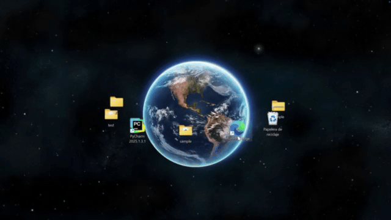

# Saturn Desktop



Animates Windows desktop icons to orbit like Saturn's rings.

## Requirements

- Windows
- Python 3.10+
- A wallpaper with a planet in the center

## Usage

1. Right-click on desktop → View → Uncheck "Align icons to grid"

2. Adjust the planet center coordinates in `main.py`:
   ```python
   cx, cy = 920, 500  # Planet center on your screen
   ```

3. Adjust the orbit size:
   ```python
   a = 420   # Horizontal semi-axis (px)
   b = 100   # Vertical semi-axis (px)
   ```

4. Run the script:
   ```bash
   python main.py
   ```

## Controls

- Rotation speed changes based on mouse position
- Closer to the center = slower rotation

## Notes

- The script automatically disables desktop "snap to grid"
- Icons passing "behind" the planet are temporarily hidden

## License

MIT No Commercial - See [LICENSE](LICENSE) for details.
